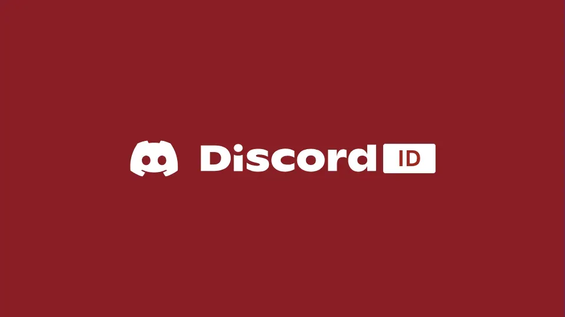

 

# Discord Indonesia GitHub Organization

Kami adalah **Discord Indonesia (Discord ID)**, komunitas terbuka yang berfokus pada pengembangan ekosistem Discord, penyediaan alat otomatisasi, serta infrastruktur pendukung bagi pengguna dan kreator di Indonesia.

Membangun ekosistem yang solid melalui inovasi berbasis komunitas, efisiensi sistem, dan kolaborasi terbuka. Fokus kami adalah menyediakan solusi teknis yang andal dan mudah diakses oleh semua pengguna.

## Linked Media

  
  
  
  
  
  
  

